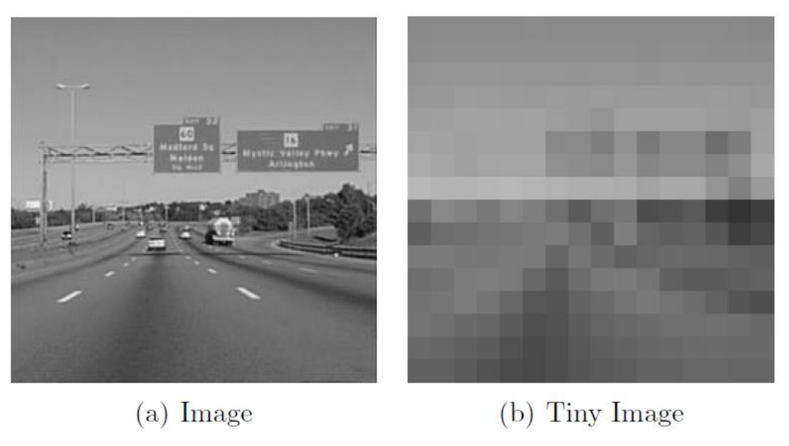

# Scene Recognition using Bag of Quantized Local Features from Images

The goal of this project is to build a set of visual recognition systems that classify the images into different scene categories. The code can recognize the following image scenes:
- Office
- Kitchen
- LivingRoom
- Bedroom
- Store
- Industrial
- TallBuilding
- InsideCity
- Street
- Highway
- Coast
- OpenCountry
- Mountain
- Forest
- Suburb

The code computes a set of basic image representations -- tiny image -- and then the model is further optimized using techniques that resemble current state-of-the-art -- bags of quantized local features. Then using these set of image representations from the training data, two classfiers -- K-Nearest Neighbors (KNN) and Support Vector Machines (SVM) -- are trained. The SVM classifier is optimized by tuning a set of its hyperparameters. These classiers are then used to predict the scene category of each testing image.

## Getting Started:

0. Download the data required for this project from https://bit.ly/2U9yQMb.
1. Extract the code zip file and the data zip file into a directory and move into that directory. This directory is reffered to as _./_
2. The training data is present in the _./train/_ folder and the corresponding image labels and paths are present in _./train.txt_
3. The testing data is present in the _./test/_ folder and the corresponding image labels and paths are present in _./test.txt_
2. The codes are present in _./_
3. Some of the helper functions are present in the _./helper\_functions/_ folder.
4. The output images produced by the codes are present in the _./outputs/_ folder.
5. The files storing the intermediate results are present in the _./objects/_ folder.
6. Execute the _Main.m_ file to begin code execution.

## Overview:

1. Tiny Image + KNN

This approach resizes the given image in 16 x 16 resolution and vectorizes it to get a tiny image format. The images are normalized and fed to a KNN classifier which classifies them into categories. This approach is naive and could be improved by using robust features from the images.

2. Bag of Words (BoW) + KNN

This approach generates the Bag of Words visual dictionary for the given set of training images and predicts the labels using KNN. It works as follows:
- Dense Scale Invariant Feature Transform (Dense SIFT) features are extracted from each image. These features capture local information from the images.
- These features are combined for every image in the training data and a pool of Dense SIFT features is formed.
- K-means clustering is performed on these pool of features to get k centroids. A collection of these centroids forms the visual dictionary. Each centroid represents a unique Dense SIFT feature averaged over all the features belonging to that particular cluster.
- For each training image, each of its Dense SIFT feature is matched with the nearest centroid from the visual vocabulary and a histogram is generated for each image. This histogram will be the BoW feature for the image.
- The normalized set of histograms for training and testing data is passed as features to a KNN classifier and the labels for testing data are predicted.
This approach gives better results as compared to the first approach.

3. Bag of Words (BoW) + SVM
This approach uses the BoW features and builds an SVM model for classification. The SVM model is optimized by tuning its hyperparameters, some of which are:
- lambda: Regularization parameter for SVM which controls the margin of SVM.
- loss function: The loss functions such as L1, L2, Logistic, HINGE, HINGE2 are considered for optimization. HINGE2 gives the best performance.

